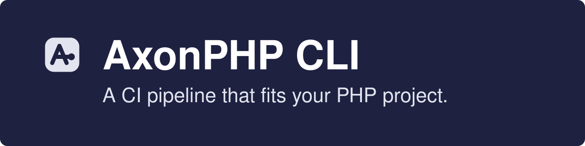
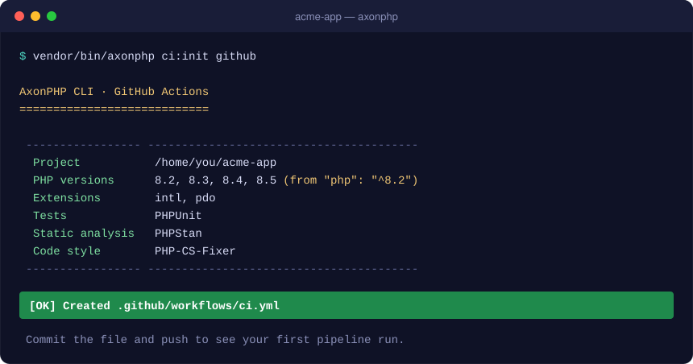
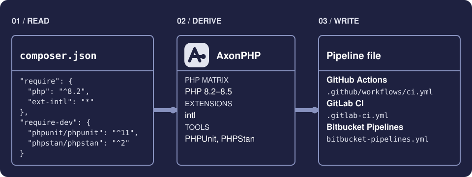

<p align="center">
  <a href="https://maximilianfeix.github.io/AxonPHPCLI/">
    
  </a>
</p>

<p align="center">
  <a href="https://github.com/maximilianfeix/AxonPHPCLI/actions/workflows/ci.yml"></a>
  <a href="https://github.com/maximilianfeix/AxonPHPCLI/releases"></a>
  
  
  
  <a href="LICENSE"></a>
</p>

<p align="center">
  <a href="https://maximilianfeix.github.io/AxonPHPCLI/"><b>Website</b></a> ·
  <a href="#installation">Installation</a> ·
  <a href="#commands">Commands</a> ·
  <a href="#configuration">Configuration</a> ·
  <a href="CHANGELOG.md">Changelog</a>
</p>

# AxonPHP CLI

AxonPHP CLI writes the CI pipeline for your PHP project so you don't have to
copy one from your last repository and fix it up by hand.

It reads your `composer.json`, works out which PHP versions you support and
which tools you use, and generates a pipeline for GitHub Actions, GitLab CI,
Bitbucket Pipelines or CircleCI that runs exactly those. No config file, no
questions to answer.

<p align="center">
  
</p>

## Features

- **Zero configuration.** Everything is derived from `composer.json`.
- **A PHP matrix that matches your constraint.** `"php": "^8.2"` becomes a test
  matrix of 8.2, 8.3, 8.4 and 8.5.
- **Runs the tools you already use.** PHPUnit, Pest, PHPStan, Psalm, Rector,
  PHP-CS-Fixer, Pint and more.
- **Four CI services.** GitHub Actions, GitLab CI, Bitbucket Pipelines and
  CircleCI from the same detection.
- **Stays in sync.** `ci:check` fails when the committed pipeline no longer
  matches the project and shows the difference; `ci:update` rewrites it.
- **Optional extras.** A code coverage job with a minimum it must reach, a
  `composer audit` step and a run against the lowest dependency versions you
  allow.
- **Sensible pipeline defaults.** Composer caching, least-privilege
  permissions, cancellation of superseded runs, and no duplicate pipelines for
  a push to a branch with an open pull request.
- **Safe to run.** It never overwrites an existing pipeline without asking, and
  `--dry-run` shows the result first.

## How it works

<p align="center">
  
</p>

## Installation

AxonPHP CLI requires PHP 8.2 or newer. Install it as a development dependency
of the project you want a pipeline for.

The package is not on Packagist yet, so point Composer at the repository first:

```bash
composer config repositories.axonphp vcs https://github.com/maximilianfeix/AxonPHPCLI
composer require --dev maxim/axonphp-cli
```

### As a PHAR

Every [release](https://github.com/maximilianfeix/AxonPHPCLI/releases) has a
single-file build attached, with a SHA-256 checksum next to it. It needs no
Composer and does not touch your project's dependencies:

```bash
curl -sSLfO https://github.com/maximilianfeix/AxonPHPCLI/releases/latest/download/axonphp.phar
php axonphp.phar ci:init github
```

## Quick start

From the root of your project:

```bash
vendor/bin/axonphp ci:init github
```

That creates `.github/workflows/ci.yml`. Commit it, push, and the pipeline runs.

Leave the provider out and AxonPHP asks which one you want. To look before you
write anything:

```bash
vendor/bin/axonphp ci:init gitlab --dry-run
```

## Commands

| Command     | What it does                                                       |
| ----------- | ------------------------------------------------------------------ |
| `ci:init`   | Generates the pipeline file for a provider                         |
| `ci:check`  | Checks that the committed pipeline still matches the project       |
| `ci:update` | Rewrites the pipelines that no longer match the project            |
| `inspect`   | Shows what was detected, as text or JSON, without writing anything |
| `tools`     | Lists every tool and provider AxonPHP supports                     |

### `ci:init`

```text
axonphp ci:init [options] [<provider>]
```

| Provider    | Service             | File written               |
| ----------- | ------------------- | -------------------------- |
| `github`    | GitHub Actions      | `.github/workflows/ci.yml` |
| `gitlab`    | GitLab CI           | `.gitlab-ci.yml`           |
| `bitbucket` | Bitbucket Pipelines | `bitbucket-pipelines.yml`  |
| `circleci`  | CircleCI            | `.circleci/config.yml`     |

| Option                         | Description                                                            |
| ------------------------------ | ---------------------------------------------------------------------- |
| `-p, --php=VERSION`            | PHP version to test against. Repeat it to build your own matrix.       |
| `-b, --branch=NAME`            | Branch whose pushes trigger the pipeline. Repeatable. Default: `main`. |
| `--coverage` / `--no-coverage` | Add a code coverage job on the newest PHP version.                     |
| `--min-coverage=PERCENT`       | Fail the coverage job below this line coverage. Implies `--coverage`.  |
| `--lowest` / `--no-lowest`     | Also test the lowest allowed dependencies on the oldest PHP version.   |
| `--audit` / `--no-audit`       | Fail on dependencies with known security advisories.                   |
| `-d, --working-dir=DIR`        | Project directory. Default: the current directory.                     |
| `-f, --force`                  | Overwrite an existing pipeline file without asking.                    |
| `--dry-run`                    | Print the pipeline to stdout and write nothing.                        |

```bash
# Test only on PHP 8.4 and 8.5, and also run on pushes to develop
vendor/bin/axonphp ci:init github --php 8.4 --php 8.5 --branch main --branch develop

# Add coverage, a lowest-dependencies run and a security audit
vendor/bin/axonphp ci:init github --coverage --lowest --audit

# Fail the pipeline when line coverage drops below 90%
vendor/bin/axonphp ci:init github --min-coverage 90
```

In `--dry-run` mode the summary goes to stderr and only the pipeline goes to
stdout, so you can redirect it.

### `ci:check`

```text
axonphp ci:check [options] [<provider>]
```

Regenerates the pipeline in memory and compares it with the file in your
project. Without a provider it checks every pipeline file it finds.

```console
$ vendor/bin/axonphp ci:check
 ✗ .github/workflows/ci.yml is out of date

   - in your file  + expected
       jobs:
   +   quality:
   +     name: Code quality
   …
```

It exits with `1` when a pipeline is missing or out of date, so you can run it
in CI or in a pre-commit hook. A pipeline goes out of date when you add a tool,
change the PHP constraint, or edit the file by hand. `ci:check` accepts the same
pipeline options as `ci:init`; store them in `composer.json`
([configuration](#configuration)) and no options are needed.

| Format            | Output                                                                       |
| ----------------- | ---------------------------------------------------------------------------- |
| `--format text`   | The list and the difference shown above. The default.                        |
| `--format github` | The same, plus an annotation on the pipeline file in the pull request.       |
| `--format json`   | `upToDate` and, per pipeline, `provider`, `path`, `status` and the `diff`.   |

### `ci:update`

```text
axonphp ci:update [options] [<provider>]
```

Rewrites every pipeline file that `ci:check` would report and leaves the ones
that are up to date alone. Run it after you add a tool or change the PHP
constraint:

```console
$ composer require --dev phpstan/phpstan
$ vendor/bin/axonphp ci:update
 ✓ .github/workflows/ci.yml updated
 ✓ .gitlab-ci.yml updated
```

`--dry-run` prints the difference and writes nothing. With a provider name it
also creates that provider's pipeline when it is missing.

### `inspect`

```text
axonphp inspect [options] [--format=text|json]
```

Prints the PHP versions, extensions, tools and options a pipeline would be
based on, and which pipeline files exist.

```bash
vendor/bin/axonphp inspect --format json | jq '.php.versions'
```

### `tools`

```text
axonphp tools [--format=text|json]
```

Lists every tool AxonPHP detects, the Composer package that triggers it and the
command the pipeline runs for it, followed by the supported providers.

### Exit codes

| Code | Meaning                                                                                      |
| ---- | -------------------------------------------------------------------------------------------- |
| `0`  | Success                                                                                      |
| `1`  | The project could not be read, a file could not be written, or `ci:check` found a difference |
| `2`  | Invalid arguments or options                                                                 |

Shell completion for commands, options and provider names is available through
`vendor/bin/axonphp completion --help`.

## Configuration

AxonPHP needs no configuration. When you want choices to stick, store them
under `extra.axonphp` in `composer.json`:

```json
{
    "extra": {
        "axonphp": {
            "php": ["8.3", "8.4"],
            "branches": ["main", "develop"],
            "coverage": true,
            "min-coverage": 90,
            "lowest": true,
            "audit": true
        }
    }
}
```

| Key            | Type            | Default                                    |
| -------------- | --------------- | ------------------------------------------ |
| `php`          | list of strings | derived from the `php` constraint          |
| `branches`     | list of strings | `["main"]`                                 |
| `coverage`     | boolean         | `false`, or `true` when a minimum is set   |
| `min-coverage` | number, 0–100   | none                                       |
| `lowest`       | boolean         | `false`                                    |
| `audit`        | boolean         | `false`                                    |

Command line options win over `extra.axonphp`, which wins over the defaults.

## What gets detected

| From `composer.json`                             | Result in the pipeline                        |
| ------------------------------------------------ | --------------------------------------------- |
| `require.php`                                    | The PHP versions in the test matrix           |
| `ext-*` packages                                 | Extensions installed before your dependencies |
| `pestphp/pest`                                   | `vendor/bin/pest`                             |
| `codeception/codeception`                        | `vendor/bin/codecept run`                     |
| `brianium/paratest`                              | `vendor/bin/paratest`                         |
| `phpunit/phpunit`                                | `vendor/bin/phpunit`                          |
| `symfony/phpunit-bridge`                         | `vendor/bin/simple-phpunit`                   |
| `phpspec/phpspec`                                | `vendor/bin/phpspec run --no-interaction`     |
| `behat/behat`                                    | `vendor/bin/behat --no-interaction`           |
| `phpstan/phpstan`, `larastan/larastan`, `nunomaduro/larastan` | `vendor/bin/phpstan analyse --no-progress` |
| `vimeo/psalm`                                    | `vendor/bin/psalm --no-progress`              |
| `rector/rector`                                  | `vendor/bin/rector process --dry-run`         |
| `deptrac/deptrac`, `qossmic/deptrac-shim`        | `vendor/bin/deptrac analyse --no-progress`    |
| `phparkitect/phparkitect`                        | `vendor/bin/phparkitect check`                |
| `friendsofphp/php-cs-fixer`, `php-cs-fixer/shim` | `vendor/bin/php-cs-fixer check --diff`        |
| `laravel/pint`                                   | `vendor/bin/pint --test`                      |
| `symplify/easy-coding-standard`                  | `vendor/bin/ecs check`                        |
| `squizlabs/php_codesniffer`                      | `vendor/bin/phpcs`                            |
| `vincentlanglet/twig-cs-fixer`                   | `vendor/bin/twig-cs-fixer lint`               |
| `ergebnis/composer-normalize`                    | `composer normalize --dry-run`                |
| `maglnet/composer-require-checker`               | `vendor/bin/composer-require-checker check`   |
| `icanhazstring/composer-unused`                  | `vendor/bin/composer-unused --no-progress`    |
| `shipmonk/composer-dependency-analyser`          | `vendor/bin/composer-dependency-analyser`     |

Tests run on every PHP version in the matrix. Static analysis, code style and
dependency checks run once, on the newest version, in a separate job.
`axonphp tools` prints this list for the version you have installed.

A few details worth knowing:

- Without a `php` constraint, the matrix defaults to 8.2, 8.3, 8.4 and 8.5.
- Only one runner of the PHPUnit family is used. Pest, Codeception and ParaTest
  win over PHPUnit, since they ship with it. PHPSpec and Behat have suites of
  their own and run in addition.
- With no test tool installed, the pipeline lints every PHP file with `php -l`
  instead, so it is still useful on day one.
- With no `composer.json` at all, you get that lint-only pipeline and a warning.
- Coverage needs PHPUnit, ParaTest or Pest. The report is written to `coverage.xml` and
  kept as a build artifact.
- A minimum coverage is enforced by Pest's own `--min` option. For PHPUnit the
  job reads the line coverage from `coverage.xml` and fails below the minimum.
- CircleCI builds every pushed branch, so the branch list is not used there.

## Example output

This repository uses the workflow AxonPHP CLI generated for itself, with
100% required coverage, lowest dependencies and the security audit switched on:
[`.github/workflows/ci.yml`](.github/workflows/ci.yml).

The [website](https://maximilianfeix.github.io/AxonPHPCLI/#output) shows the
output for all four providers side by side.

The generated file is a starting point that belongs to you. Edit it freely;
AxonPHP only touches it again when you run `ci:update` or `ci:init --force`.

## Development

```bash
git clone https://github.com/maximilianfeix/AxonPHPCLI.git
cd AxonPHPCLI
composer install
composer check   # code style, PHPStan (level max), tests and ci:check
```

The code is small and split by responsibility:

```text
src/
├── Command/    ci:init, ci:check, ci:update, inspect and tools
├── Diff/       the line diff ci:check prints
├── Pipeline/   decides which jobs a pipeline has and what they run
├── Project/    reads composer.json: PHP versions, extensions, tools, settings
└── Provider/   translates that plan into the YAML of one CI service
site/           builds the website in docs/ from the same code
tools/          builds the PHAR attached to each release
```

Adding a tool is one entry in `ToolCatalog`. Adding a CI service is one class
implementing `Provider`. [CONTRIBUTING.md](CONTRIBUTING.md) walks through both.

## Contributing

Issues and pull requests are welcome. Please read
[CONTRIBUTING.md](CONTRIBUTING.md) first, and report security problems
privately as described in [SECURITY.md](SECURITY.md).

## License

Released under the [MIT License](LICENSE).
